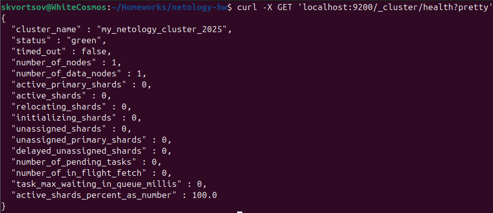
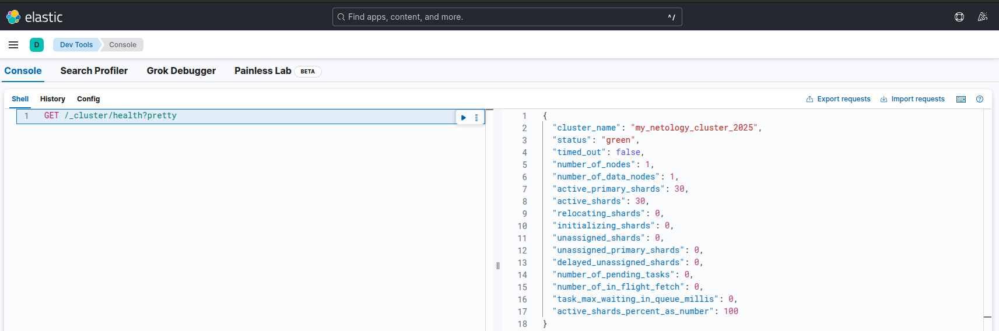
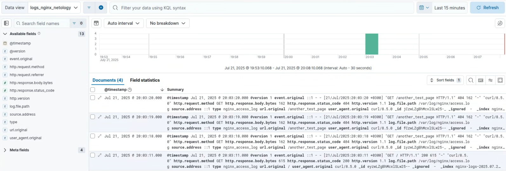
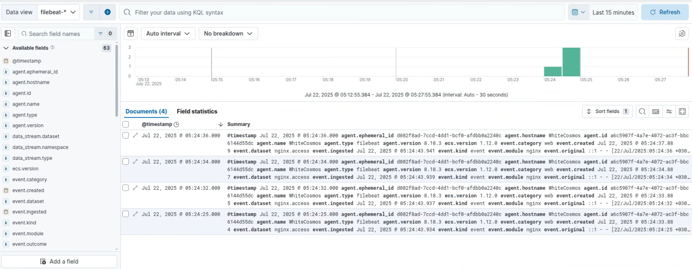

# Домашнее задание к занятию "`ELK`" - `Скворцов Александр`

## Задание 1. Elasticsearch

1. Установите и запустите Elasticsearch, после чего поменяйте параметр cluster_name на случайный.
2. Приведите скриншот команды 'curl -X GET 'localhost:9200/_cluster/health?pretty', сделанной на сервере с установленным Elasticsearch. Где будет виден нестандартный cluster_name.

**Результат выполнения:**

---

## Задание 2. Kibana

1. Установите и запустите Kibana.
2. Приведите скриншот интерфейса Kibana на странице http://<ip вашего сервера>:5601/app/dev_tools#/console, где будет выполнен запрос GET /_cluster/health?pretty.

**Результат выполнения:**

---

## Задание 3. Logstash

1. Установите и запустите Logstash и Nginx. С помощью Logstash отправьте access-лог Nginx в Elasticsearch.
2. Приведите скриншот интерфейса Kibana, на котором видны логи Nginx.

**Результат выполнения:**

---

## Задание 4. Запись данных в Redis

1. Установите и запустите Filebeat. Переключите поставку логов Nginx с Logstash на Filebeat.
2. Приведите скриншот интерфейса Kibana, на котором видны логи Nginx, которые были отправлены через Filebeat.

**Результат выполнения:**

