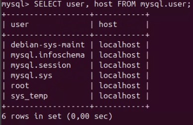
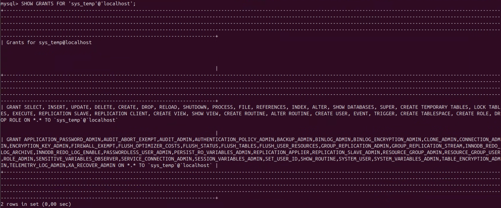
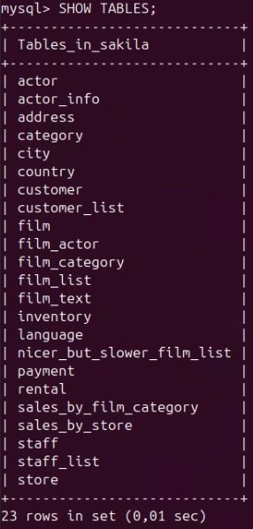

# Домашнее задание к занятию "`Работа с данными (DDL/DML)`" - `Скворцов Александр`


## Задание 1

**Требования к заданию:**
1. Поднимите чистый инстанс MySQL версии 8.0+. Можно использовать локальный сервер или контейнер Docker.
2. Создайте учётную запись sys_temp.
3. Выполните запрос на получение списка пользователей в базе данных. (скриншот)
4. Дайте все права для пользователя sys_temp.
5. Выполните запрос на получение списка прав для пользователя sys_temp. (скриншот)
6. Переподключитесь к базе данных от имени sys_temp.

**Для смены типа аутентификации с sha2 используйте запрос:**
```
ALTER USER 'sys_test'@'localhost' IDENTIFIED WITH mysql_native_password BY 'password';
```
7. По ссылке https://downloads.mysql.com/docs/sakila-db.zip скачайте дамп базы данных.
8. Восстановите дамп в базу данных.
9. При работе в IDE сформируйте ER-диаграмму получившейся базы данных. При работе в командной строке используйте команду для получения всех таблиц базы данных. (скриншот)

**Процесс выполнения:**

1. Создание учетной записи sys_temp:

```
CREATE USER 'sys_temp'@'localhost' IDENTIFIED BY 'password';
```
2. Запрос на получение списка пользователей в БД:



3. Запрос на получение списка прав для пользователя sys_temp:



4. ER-диаграмма получившейся БД:



---

## Задание 2

**Требования к заданию:**
1. Составьте таблицу, используя любой текстовый редактор или Excel, в которой должно быть два столбца: в первом должны быть названия таблиц восстановленной базы, во втором названия первичных ключей этих таблиц. Пример: (скриншот/текст)

```
Название таблицы | Название первичного ключа
customer         | customer_id
```

**Процесс выполнения:**

```
+---------------+--------------+
| TABLE_NAME    | COLUMN_NAME  |
+---------------+--------------+
| actor         | actor_id     |
| address       | address_id   |
| category      | category_id  |
| city          | city_id      |
| country       | country_id   |
| customer      | customer_id  |
| film          | film_id      |
| film_actor    | actor_id     |
| film_actor    | film_id      |
| film_category | film_id      |
| film_category | category_id  |
| film_text     | film_id      |
| inventory     | inventory_id |
| language      | language_id  |
| payment       | payment_id   |
| rental        | rental_id    |
| staff         | staff_id     |
| store         | store_id     |
+---------------+--------------+
```
