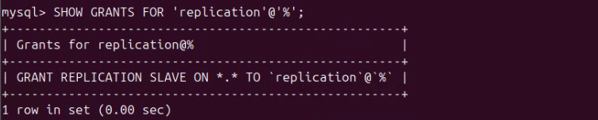
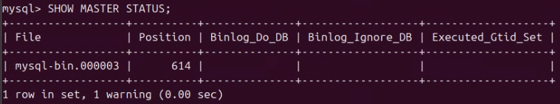
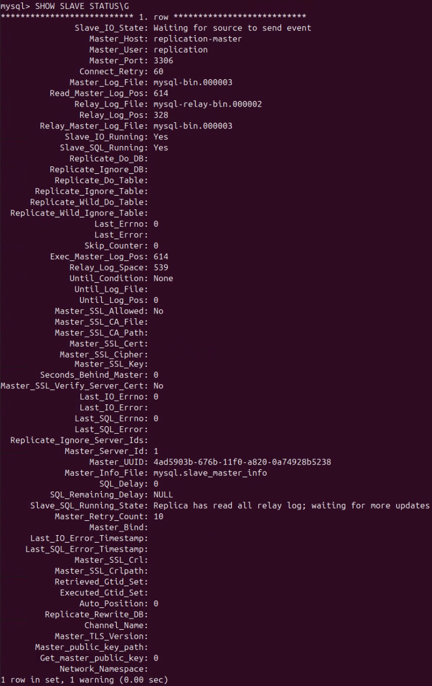
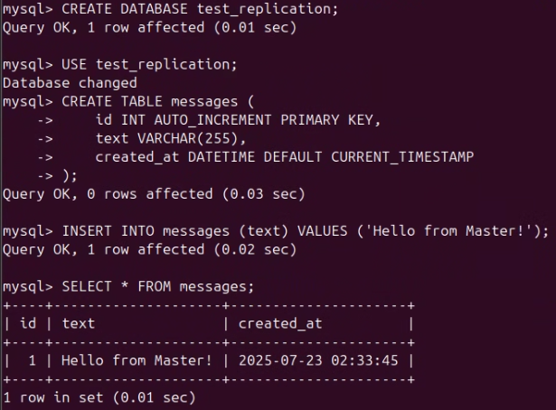
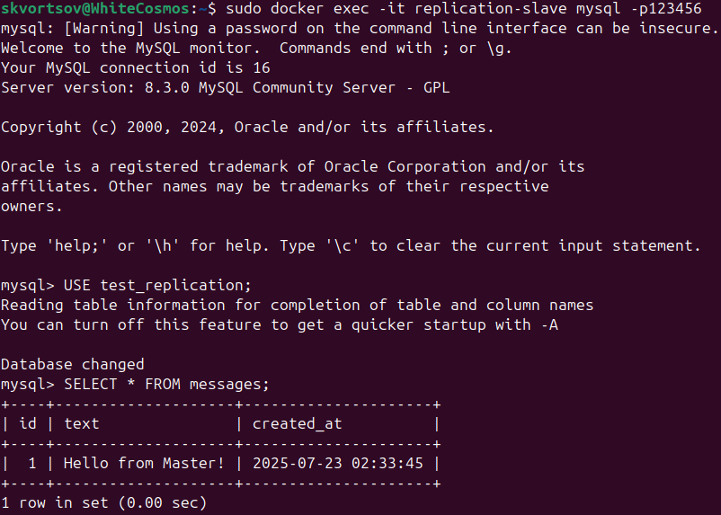

# Домашнее задание к занятию "`Репликация и масштабирование. Часть 1`" - `Скворцов Александр`

## Задание 1

**Требования к заданию:**
1. На лекции рассматривались режимы репликации master-slave, master-master, опишите их различия.
2. Ответить в свободной форме.

**Процесс выполнения:**

**Режим репликации Master-Slave:**
В этом режиме есть один главный сервер (Master) и один или несколько второстепенных серверов (Slave). Все операции записи (INSERT, UPDATE, DELETE) выполняются только на Master-сервере. Slave-серверы подключаются к Master-серверу, считывают эти изменения из бинарного лога и применяют их к своим локальным копиям данных.

**Режим репликации Master-Master:**
В этом режиме есть два или более Master-серверов, и каждый из них может принимать операции записи. Изменения, сделанные на одном Master-сервере, реплицируются на все другие Master-серверы, и наоборот. Каждый сервер является как Master (для других), так и Slave (получая от других).

---

## Задание 2

**Требования к заданию:**
1. Выполните конфигурацию master-slave репликации, примером можно пользоваться из лекции.
2. Приложите скриншоты конфигурации, выполнения работы: состояния и режимы работы серверов.

**Процесс выполнения:**

**Создание контейнеров с необходимыми настройками:**

**Конфигурация Master: Права пользователя для репликации:**

**Конфигурация Master: Позиция бинарного лога:**

**Состояние и режим работы серверов Slave: Статус репликации:**

**Проверка репликации на master:**

**Проверка репликации на slave:**

