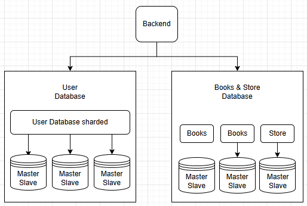

# Домашнее задание к занятию "`Репликация и масштабирование. Часть 2`" - `Скворцов Александр`

## Задание 1

**Требования к заданию:**
1. Опишите основные преимущества использования масштабирования методами:
   * активный master-сервер и пассивный репликационный slave-сервер;
   * master-сервер и несколько slave-серверов;
2. Дайте ответ в свободной форме.

**Процесс выполнения:**

1. **Активный master-сервер и пассивный репликационный slave-сервер:**

Это базовая конфигурация Master-Slave репликации, где есть один главный сервер (Master) и один второстепенный сервер (Slave). Master обрабатывает все операции записи и чтения, в то время как Slave постоянно синхронизируется с Master, получая и применяя все изменения.

**Основные преимущества:**
1. Высокая доступность (High Availability) и аварийное восстановление (Disaster Recovery).
2. Целостность данных (Data Integrity) и безопасность.
3. Удобство для обслуживания.

2. **Master-сервер и несколько Slave-серверов:**

Это расширение Master-Slave репликации, где один Master-сервер реплицирует данные на несколько Slave-серверов. Каждый Slave является точной или почти точной копией Master.

**Основные преимущества:**
1. Масштабирование чтения (Read Scaling).
2. Высокая доступность и отказоустойчивость. (Наличие нескольких Slave-серверов увеличивает шансы на быстрое восстановление в случае отказа Master).
3. Отчетность и аналитика. (Тяжёлые запросы для формирования отчётов можно выполнять на отдельных Slave-серверах.
4. Тестирование и разработка. (Один или несколько Slave-серверов могут использоваться для тестирования новых версий приложений, запросов или миграций данных, не затрагивая производственный Master.)

---

## Задание 2

**Требования к заданию:**
1. Разработайте план для выполнения горизонтального и вертикального шаринга базы данных. База данных состоит из трёх таблиц:
   * пользователи,
   * книги,
   * магазины (столбцы произвольно).
2. Опишите принципы построения системы и их разграничение или разбивку между базами данных.
3. Пришлите блоксхему, где и что будет располагаться. Опишите, в каких режимах будут работать сервера.

**Процесс выполнения:**

    Представим, что это база данных книжного интернет-магазина. Всего на нашем портале зарегистрировано 600 пользователей, данные о пользователях у нас размещены в таблице Users. Для повышения ее производительности и уменьшения скорости обработки запросов разделим ее на 3 части (выполним партиционирование). Мы будем делить таблицу с пользователями на части по user_id. Данные каждых следующих 200 вновь зарегистрированных пользователей мы будем хранить в отдельных логических таблицах на разных серверах.
    Чтобы оптимизировать закупки и ассортимент, мы будем хранить информацию о книгах в таблице Books. Таблица Books будет связана с таблицей Users через столбец book_id. Это позволит нам отслеживать, какие книги пользуются наибольшим спросом. Решено не усложнять структуру базы данных созданием дополнительной таблицы для заказов (order_id), так как по условиям задания у нас должно быть всего три таблицы. Партиционирование таблицы Books будет выполнено по аналогии с таблицей Users.
    Оффлайн- и онлайн-магазины будут представлены в третьей таблице — Stores. Так как количество магазинов ожидается небольшим по сравнению с пользователями и книгами, горизонтальное партиционирование для таблицы Stores применяться не будет. Шардирование этой таблицы нецелесообразно, учитывая её значительно меньший размер по сравнению с таблицами Users и Books. Таблица Stores будет связана с Books через book_id для отслеживания ассортимента в каждой точке продаж, а с Users через user_id для оценки посещаемости магазинов.
    Горизонтальное шардирование, то есть распределение таблиц по разным серверам, эффективно при значительно больших объемах данных (от десятков тысяч строк и более). В нашем же случае для повышения отказоустойчивости предлагается реализовать репликацию базы данных на второй сервер.

**Блок-схема:**

**Объяснения к блок-схеме:**

1. User Database - база данных пользователей:
   * Каждый "User" - отдельный сервер или кластер серверов MySQL, отвечающий за определенный диапазон user_id.
   * Каждый шард включает Master-сервер (для записи и чтения) и один или несколько Slave-серверов (для масштабирования чтения и отказоустойчивости), работающих в режиме Master-Slave репликации.
2. Books & Stores Database - база данных книг и магазинов:
   * Каждый "Book" - Master-сервер и один или несколько Slave-серверов, работающих в режиме Master-Slave.
   * Таблица Stores (так как она не шардируется) будет находиться на отдельной Master-Slave паре серверов внутри этого кластера, поскольку ее размер не требует горизонтального разбиения.
3. Backend (Сервисы бэкенда) - приложение, которое обрабатывает бизнес-логику (например, обработка заказов, управление каталогом).
