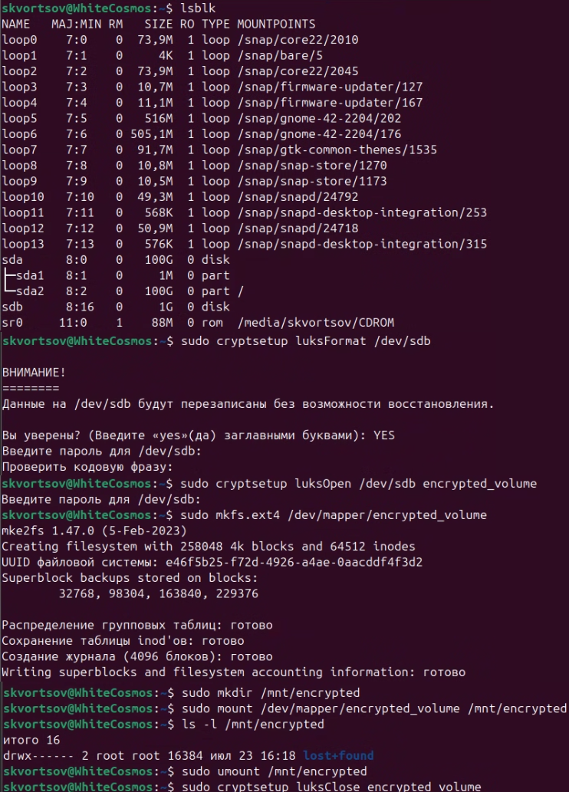

# Домашнее задание к занятию "`Уязвимости и атаки на информационные системы`" - `Скворцов А.Р.`

## Задание 1

**Цели задания:**
1. Установите eCryptfs.
2. Добавьте пользователя cryptouser.
3. Зашифруйте домашний каталог пользователя с помощью eCryptfs.
4. В качестве ответа пришлите снимки экрана домашнего каталога пользователя с исходными и зашифрованными данными.

**Процесс выполнения:**

---

## Задание 2

**Цели задания:**
1. Установите поддержку LUKS.
2. Создайте небольшой раздел, например, 100 Мб.
3. Зашифруйте созданный раздел с помощью LUKS.
4. В качестве ответа пришлите снимки экрана с поэтапным выполнением задания.

**Процесс выполнения:**

