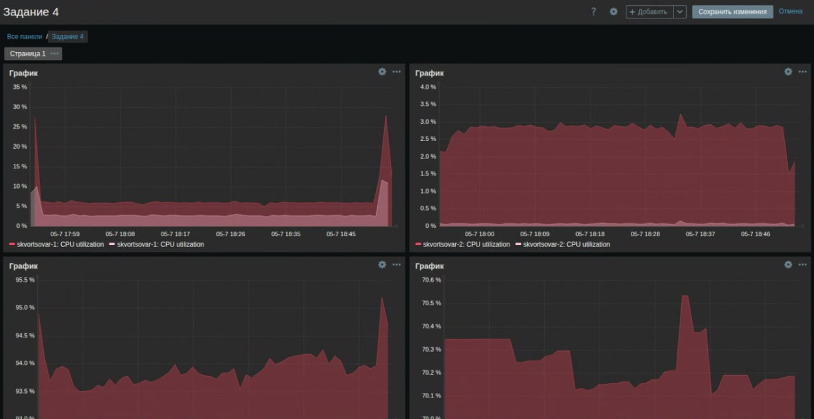

# Домашнее задание к занятию "`Система мониторинга Zabbix`" - `Скворцов Александр`


## Задание 1

Создайте свой шаблон, в котором будут элементы данных, мониторящие загрузку CPU и RAM хоста.

**Процесс выполнения:**
1. Выполняя ДЗ, сверяйтесь с процессом, отражённым в записи лекции.
2. В веб-интерфейсе Zabbix Servera в разделе Templates создайте новый шаблон
3. Создайте Item который будет собирать информацию об загрузке CPU в процентах
4. Создайте Item который будет собирать информацию об загрузке RAM в процентах

**Требования к результату:**
1. Создайте Item который будет собирать информацию об загрузке RAM в процентах

### Результат работы:


---

## Задание 2

Добавьте в Zabbix два хоста и задайте им имена <фамилия и инициалы-1> и <фамилия и инициалы-2>. Например: ivanovii-1 и ivanovii-2.

**Процесс выполнения:**
1. Выполняя ДЗ, сверяйтесь с процессом, отражённым в записи лекции.
2. Установите Zabbix Agent на 2 вирт.машины, одной из них может быть ваш Zabbix Server.
3. Добавьте Zabbix Server в список разрешенных серверов ваших Zabbix Agentов.
4. Добавьте Zabbix Agentов в раздел Configuration > Hosts вашего Zabbix Servera.
5. Прикрепите за каждым хостом шаблон Linux by Zabbix Agent
6. Проверьте, что в разделе Latest Data начали появляться данные с добавленных агентов.

**Требования к результатам:**
1. Результат данного задания сдавайте вместе с заданием 3

### Хост 1: Zabbix Server VM (Ubuntu 24.04):
**Настройка Zabbix Agent на Хосте 1:**
```
sudo nano /etc/zabbix/zabbix_agentd.conf
```
**Проверил следующие настройки:**
1. Server=127.0.0.1
2. ServerActive=127.0.0.1
3. Hostname=skvortsovar-1

**Перезапуск и проверка Zabbix Agent, посредством следующих команд:**
```
sudo systemctl restart zabbix-agent
sudo systemctl status zabbix-agent
tail -f /var/log/zabbix/zabbix_agentd.log
```
**Перезапуск и проверка Zabbix Agent:**
```
sudo systemctl restart zabbix-agent
sudo systemctl status zabbix-agent
tail -f /var/log/zabbix/zabbix_agentd.log
```

### Хост 2: Отдельная Ubuntu Server VM (Ubuntu Server 24.04):

**Установка Zabbix Agent на Хосте 2:**
```
wget https://repo.zabbix.com/zabbix/7.0/ubuntu/pool/main/z/zabbix-release/zabbix-release_latest_7.0+ubuntu24.04_all.deb
dpkg -i zabbix-release_latest_7.0+ubuntu24.04_all.deb
sudo apt update
sudo apt install zabbix-agent -y
```
**Настройка Zabbix Agent на Хосте 2:**
```
sudo nano /etc/zabbix/zabbix_agentd.conf
```
**Проверил следующие настройки:**
1. Server=192.168.157.130
2. ServerActive=192.168.157.130
3. Hostname=skvortsovar-2

**Перезапуск и проверка Zabbix Agent:**
```
sudo systemctl restart zabbix-agent
sudo systemctl status zabbix-agent
tail -f /var/log/zabbix/zabbix_agentd.log
```
---

## Задание 3

Привяжите созданный шаблон к двум хостам. Также привяжите к обоим хостам шаблон Linux by Zabbix Agent.

**Процесс выполнения:**
1. Выполняя ДЗ, сверяйтесь с процессом, отражённым в записи лекции.
2. Зайдите в настройки каждого хоста и в разделе Templates прикрепите к этому хосту ваш шаблон
3. Так же к каждому хосту привяжите шаблон Linux by Zabbix Agent
4. Проверьте что в раздел Latest Data начали поступать необходимые данные из вашего шаблона

**Требования к результатам:**
1. Прикрепите в файл README.md скриншот страницы хостов, где будут видны привязки шаблонов с названиями «Задание 2-3». Хосты должны иметь зелёный статус подключения


### Результат работы:

1. Скриншот раздела Configuration > Hosts:


2. Скриншот раздела Monitoring > Latest data для обоих хостов с данными из моего шаблона:


3. Скриншот раздела Monitoring > Latest data для обоих хостов с данными из моего шаблона:


---

## Задание 4

Создайте свой кастомный дашборд.

**Процесс выполнения:**
1. Выполняя ДЗ, сверяйтесь с процессом, отражённым в записи лекции.
2. Создайте свой кастомный дашборд.
3. Разместите на нём несколько графиков на ваше усмотрение.

**Требования к результатам:**
1. Прикрепите в файл README.md скриншот дашборда с названием «Задание 4»


### Результат работы:

1. Скриншот кастомного дашборда:

