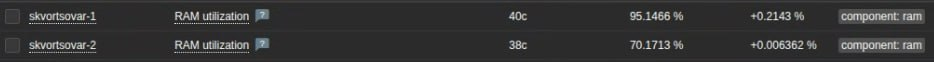

# Домашнее задание к занятию "`Система мониторинга Zabbix`" - `Скворцов Александр`


### Задание 1

Установите Zabbix Server с веб-интерфейсом.

**Процесс выполнения:**
1. Выполняя ДЗ, сверяйтесь с процессом отражённым в записи лекции.
2. Установите PostgreSQL. Для установки достаточна та версия, что есть в системном репозитороии Debian 11.
3. Пользуясь конфигуратором команд с официального сайта, составьте набор команд для установки последней версии Zabbix с поддержкой PostgreSQL и Apache.
4. Выполните все необходимые команды для установки Zabbix Server и Zabbix Web Server.

**Требования к результатам:**
1. Прикрепите в файл README.md скриншот авторизации в админке.
2. Приложите в файл README.md текст использованных команд в GitHub.

**1. Установка PostgreSQL:**
```
sudo apt install postgresql postgresql-contrib -y
sudo systemctl status postgresql
```

**2. Установка репозитория Zabbix:**
```
wget https://repo.zabbix.com/zabbix/7.0/ubuntu/pool/main/z/zabbix-release/zabbix-release_latest_7.0+ubuntu24.04_all.deb
dpkg -i zabbix-release_latest_7.0+ubuntu24.04_all.deb
sudo apt update
```
**3. Установка Zabbix сервера, веб-интерфейса и агента:**
```
sudo apt install zabbix-server-pgsql zabbix-frontend-php php8.3-pgsql zabbix-apache-conf zabbix-sql-scripts zabbix-agent
```

**4. Создание базы данных:**
```
sudo -u postgres createuser --pwprompt zabbix
sudo -u postgres createdb -O zabbix zabbix
zcat /usr/share/zabbix-sql-scripts/postgresql/server.sql.gz | sudo -u zabbix psql zabbix
```


---

## Задание 2

Установите Zabbix Agent на два хоста.

**Процесс выполнения:**
1. Выполняя ДЗ, сверяйтесь с процессом отражённым в записи лекции.
2. Установите Zabbix Agent на 2 вирт.машины, одной из них может быть ваш Zabbix Server.
3. Добавьте Zabbix Server в список разрешенных серверов ваших Zabbix Agentов.
4. Добавьте Zabbix Agentов в раздел Configuration > Hosts вашего Zabbix Servera.
5. Проверьте, что в разделе Latest Data начали появляться данные с добавленных агентов.

**Требования к результатам:**
1. Приложите в файл README.md скриншот раздела Configuration > Hosts, где видно, что агенты подключены к серверу
2. Приложите в файл README.md скриншот лога zabbix agent, где видно, что он работает с сервером
3. Приложите в файл README.md скриншот раздела Monitoring > Latest data для обоих хостов, где видны поступающие от агентов данные.
4. Приложите в файл README.md текст использованных команд в GitHub

### Хост 1: Zabbix Server VM (Ubuntu 24.04):
Агент был установлен ранее, когда выполнялось первое задание.
**Настройка Zabbix Agent на Хосте 1:**
```
sudo nano /etc/zabbix/zabbix_agentd.conf
```
**Проверил следующие настройки:**
1. Server=127.0.0.1
2. ServerActive=127.0.0.1
3. Hostname=Zabbix server

**Перезапуск и проверка Zabbix Agent, посредством следующих команд:**
```
sudo systemctl restart zabbix-agent
sudo systemctl status zabbix-agent
tail -f /var/log/zabbix/zabbix_agentd.log
```
**Перезапуск и проверка Zabbix Agent:**
```
sudo systemctl restart zabbix-agent
sudo systemctl status zabbix-agent
tail -f /var/log/zabbix/zabbix_agentd.log
```

### Хост 2: Отдельная Ubuntu Server VM (Ubuntu Server 24.04):

**Установка Zabbix Agent на Хосте 2:**
```
wget https://repo.zabbix.com/zabbix/7.0/ubuntu/pool/main/z/zabbix-release/zabbix-release_latest_7.0+ubuntu24.04_all.deb
dpkg -i zabbix-release_latest_7.0+ubuntu24.04_all.deb
sudo apt update
sudo apt install zabbix-agent -y
```
**Настройка Zabbix Agent на Хосте 2:**
```
sudo nano /etc/zabbix/zabbix_agentd.conf
```
**Проверил следующие настройки:**
1. Server=192.168.157.130
2. ServerActive=192.168.157.130
3. Hostname=Ubuntu server

**Перезапуск и проверка Zabbix Agent:**
```
sudo systemctl restart zabbix-agent
sudo systemctl status zabbix-agent
tail -f /var/log/zabbix/zabbix_agentd.log
```

### Результаты:

1. Скриншот раздела Configuration > Hosts:


2. Скриншот лога zabbix agent:


3. Скриншот раздела Monitoring > Latest data для обоих хостов:

