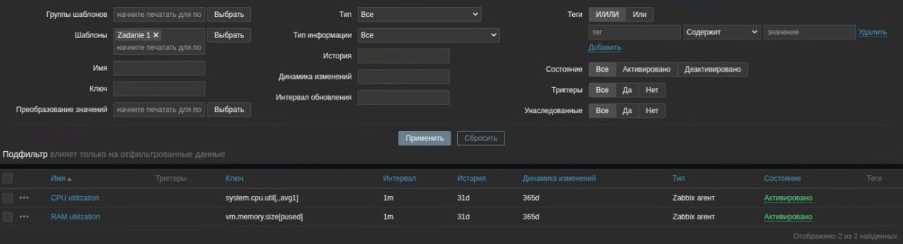
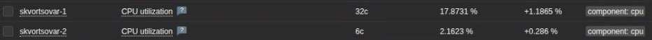

# Домашнее задание к занятию "GitLab" - `Скворцов Александр`

### Задание 1
Что нужно сделать:
1. Разверните GitLab локально, используя Vagrantfile и инструкцию, описанные в этом репозитории.
2. Создайте новый проект и пустой репозиторий в нём.
3. Зарегистрируйте gitlab-runner для этого проекта и запустите его в режиме Docker. Раннер можно регистрировать и запускать на той же виртуальной машине, на которой запущен GitLab.
4. В качестве ответа в репозиторий шаблона с решением добавьте скриншоты с настройками раннера в проекте.

Процесс выполнения:
1. Я развернул GitLab локально с помощью Vagrant и VirtualBox. GitLab доступен по адресу `http://gitlab.localdomain`.
2. После этого я создал новый проект и зарегистрировал `gitlab-runner` в режиме Docker.
3. Ниже представлены скриншоты, подтверждающие успешную регистрацию и активность раннера:

`
---
`

---
### Задание 2
Что нужно сделать:
1. Запушьте репозиторий на GitLab, изменив origin. Это изучалось на занятии по Git.
2. Создайте .gitlab-ci.yml, описав в нём все необходимые, на ваш взгляд, этапы.
В качестве ответа в шаблон с решением добавьте:
1. Файл gitlab-ci.yml для своего проекта или вставьте код в соответствующее поле в шаблоне;
2. Скриншоты с успешно собранными сборками.

`
---
`

